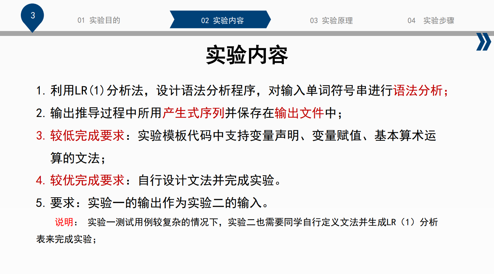
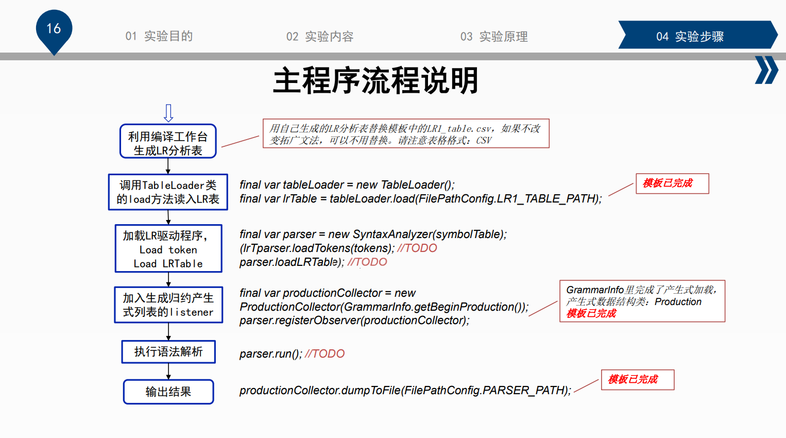
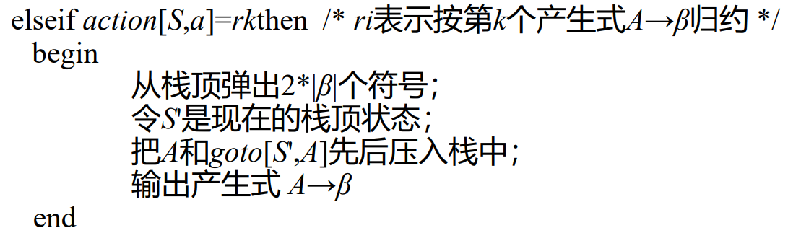

# 编译原理实验
## 实验1
## 实验2 语法分析
___
实验内容：

### LR(1)文法
**从左向右扫描，自底向上分析**

1. 编译工作台生成LR分析表  

   <font color=yellow size = 2>  
   *没有自定义文法，暂时不用，使用现成的*
   </font>

2. 调用`TableLoader`

2. 加载LR驱动程序
``` java
final var parser = new SyntaxAnalyzer(symbolTable);
(lrTparser.loadTokens(tokens); //TODO
parser.loadLRTableable); //TODO
```
要确定符号栈和状态栈的实现形式  
将栈定义为: `Stack<Union<Token, NonTerminal>>`. 
因为我们只将`Union`在这里使用一次, 我们可以简单定义一个`Symbol`来实现`Union<Token, NonTerminal>`的功能
``` java
class Symbol{
    Token token;
    NonTerminal nonTerminal;

    private Symbol(Token token, NonTerminal nonTerminal){
        this.token = token;
        this.nonTerminal = nonTerminal;
    }

    public Symbol(Token token){
        this(token, null);
    }

    public Symbol(NonTerminal nonTerminal){
        this(null, nonTerminal);
    }

    public isToken(){
        return this.token != null;
    }

    public isNonterminal(){
        return this.nonTerminal != null;
    }
}
```

`LR1_table.csv`的用法：  
`ACTION`：  
横坐标：状态`state`  
纵坐标：终结符`Terminal`
`(0, id) = shift 4`: 状态0下，移进id并转移到状态4，指针执行下一个输入符号  
`(7, id) = reduce D -> int` 按表达式`D -> int`进行规约


3. 加入生成归约产生式列表


4. 执行语法分析
``` java
parser.run(); //TODO
```
## 实验3
## 实验4
